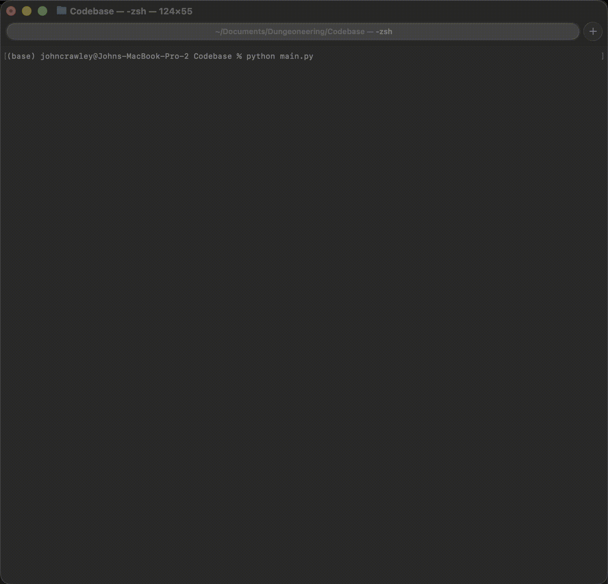

# Dungeoneering

```text
██████╗ ██╗   ██╗███╗   ██╗ ██████╗ ███████╗ ██████╗ ███╗   ██╗ ███████╗ ███████╗ ██████╗ ██████╗ ██╗███╗   ██╗ ██████╗
██╔══██╗██║   ██║████╗  ██║██╔════╝ ██╔════╝██╔═══██╗████╗  ██║ ██╔════╝ ██╔════╝██╔═══██╗██╔══██╗██║████╗  ██║██╔════╝
██║  ██║██║   ██║██╔██╗ ██║██║  ███╗█████╗  ██║   ██║██╔██╗ ██║ █████╗   █████╗  ██║   ██║██████╔╝██║██╔██╗ ██║██║  ███╗
██║  ██║██║   ██║██║╚██╗██║██║   ██║██╔══╝  ██║   ██║██║╚██╗██║ ██╔══╝   ██╔══╝  ██║   ██║██╔══██╗██║██║╚██╗██║██║   ██║
██████╔╝╚██████╔╝██║ ╚████║╚██████╔╝███████╗╚██████╔╝██║ ╚████║ ███████╗ ███████╗╚██████╔╝██║  ██║██║██║ ╚████║╚██████╔╝
╚═════╝  ╚═════╝ ╚═╝  ╚═══╝ ╚═════╝ ╚══════╝ ╚═════╝ ╚═╝  ╚═══╝ ╚══════╝ ╚══════╝ ╚═════╝ ╚═╝  ╚═╝╚═╝╚═╝  ╚═══╝ ╚═════╝
```

(Currently in development)
<span style="color:red;">PLEASE READ: Please keep in mind this is an active project, therefore I'm still developing and squashing bugs and issues so there's areas that are buggy. Plus files will be moved around</span>

Dungeoneering is a text adventure game written in Python & JSON made by John Crawley. The purpose is you choose between human (no special attacks and this play style is the hardest), mage (magic), warrior (battle ready) or ranger (play by distance), you go around the entire dungeon and build up your character, find loot and find the boss key to be able to take on the final boss in the game

If you would like to see the current development roadmap of this project, kindly visit the [development roadmap](https://github.com/users/JohnMichaelCrawley/projects/2/views/1)


# Demo


## Tech Stack
- Python
- JSON

## Command List
### Get help 
If you're stuck with list of commands, you can simply use the help command and it'll display commands to you 
```
help
```

### movement:
Move between the dungeon rooms
```
go <north, south, east, west>
```

### Look 
Examine what's currently in the same room as you, see what enemies there are and what items are in the room
```
look
```

### Attack 
When you want to attack an emeny, you simply use attack 
```
attack
````
or if there's multiple enemies, you'll be prompt with (for example):
[1] - Imp
[2] - Skeleton

You then use the following (in this case, I'll attack the imp)

```
attack 1
```


### Inventory
If you want to check what you have on you, you can use the following commands (both do the same thing, 'i' is just a shortcut way of finding out)
```
inventory
```

```
i
```
### Take
If you want to take an item in a room, you can do the follow commands for this. 

Take a specific item
```
take <item name>
```

Take all items:
```
take all
```

### Drop 
If you want to drop an item, simply use 
```
drop <item>
```

### Equip 
If you find an equipment you want to use, simply use:
```
equip <item name>
```
### Eat 
If you find food and want to heal up, you can use the eat command
```
eat <item name>
```
### Drink 
If you find potions either for xp or healing for example, same as eating, you do the following
``` 
drink <potion name>
```
### Map 
Do you want to see the map?, you can. You use just map command
```
map
```

Symbol meaning on the map:
Player's current location = ▼
Visited locations = X

### Stats
If you want to learn or know your stats in the game like health or level/xp, you can just type:
```
stats
```

### Quiting the game
If you want to quit the game at any point, you can just type any of the following (when you quit, the game will automatically save before quitting)

```
quit
```

``` 
exit
```

``` 
q
```

### Saving the game
The game doesn't automatically save the game, therefore to save the game, you just type:
```
save
```
This will create a file 'savefile.json' and can be loaded when you re-enter the game


## How To Run Dungeoneering
### Locally
cd into the Codebase folder, then run ``python main.py``

### Docker 
(I will make a dockerfile once the project is complete)

# License 
Copyright © 2026  John Crawley I retain all rights to my source code and no one may reproduce, distribute, or create derivative works from my work.
